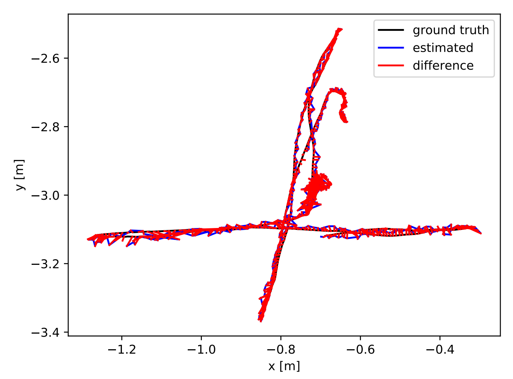
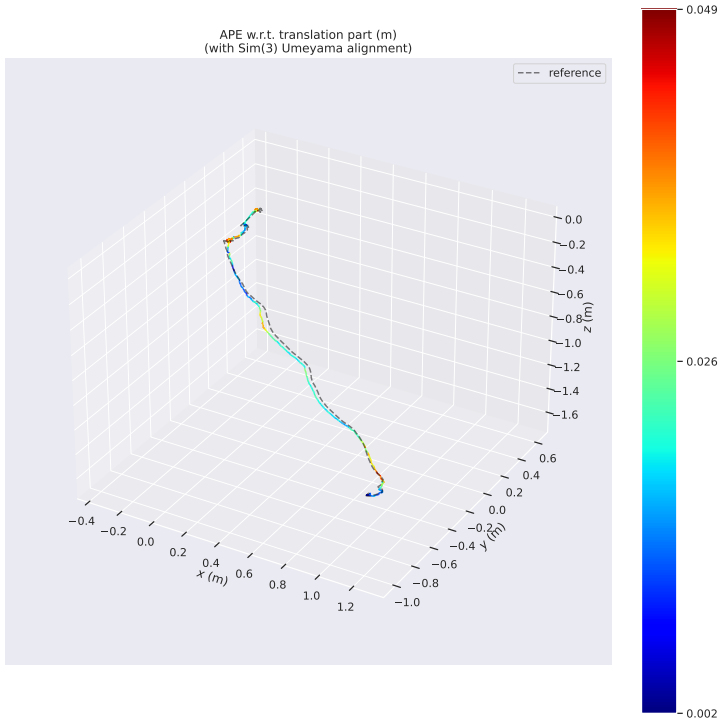
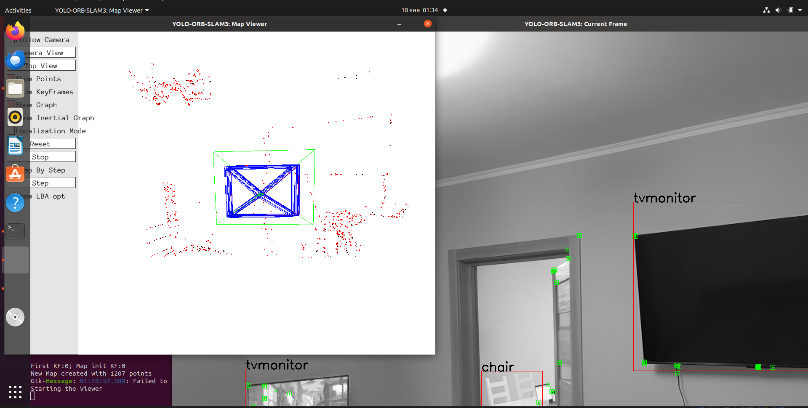

# YDD-SLAM-pr-itmo

## Описание проекта

Воспроизведение результатов исследования **YDD-SLAM: A YOLOv5 and Depth-Aware Dynamic Object Removal Algorithm for Stereo Visual SLAM in Dynamic Environments** (MDPI Sensors, 2023).

**Цель:**
- Воспроизвести результаты статьи на TUM RGB-D датасете
- Протестировать систему на собственных данных
- Оценить точность в динамических сценах

**Команда:** [Взглядов Захар Евгеьневич] (индивидуальная работа)

---

## Технологии

- **SLAM:** ORB-SLAM3 с интеграцией YOLOv5
- **Детекция объектов:** YOLOv5 (маскирование динамических объектов)
- **Библиотеки:** OpenCV 4.2.0, Pangolin, LibTorch 1.11.0, Eigen3
- **ОС:** Ubuntu 20.04 LTS (VirtualBox)
- **Язык:** Python

---

## Структура репозитория

- `src/` — исходный код (YOLO_ORB_SLAM3 + скрипты обработки данных)
- `docs/` — отчет, презентация, скриншоты
- `results/` — траектории, графики, метрики
- `configs/` — файлы калибровки камер
- `Dockerfile` — контейнер для воспроизводимости
- `setup_environment.sh` — автоматическая установка зависимостей

---

## Установка и запуск

### 1. Клонирование репозитория
```bash
git clone https://github.com/[твой-username]/YDD-SLAM-Reproduction.git
cd YDD-SLAM-Reproduction
```

### 2. Установка зависимостей

**Вариант A: Автоматическая установка (рекомендуется)**
```bash
chmod +x setup_environment.sh
./setup_environment.sh
```

**Вариант B: Ручная установка**

См. подробную инструкцию в `docs/report.pdf` (раздел 2.2).

Основные шаги:
```bash
# OpenCV 4.2.0
git clone https://github.com/opencv/opencv.git
git clone https://github.com/opencv/opencv_contrib.git
cd opencv && mkdir build && cd build
cmake -DOPENCV_EXTRA_MODULES_PATH=../../opencv_contrib/modules ..
make -j4 && sudo make install

# Pangolin
git clone https://github.com/stevenlovegrove/Pangolin.git
cd Pangolin && mkdir build && cd build
cmake -DBUILD_PANGOLIN_PYTHON=OFF ..
make -j4 && sudo make install

# LibTorch 1.11.0
wget https://download.pytorch.org/libtorch/cpu/libtorch-cxx11-abi-shared-with-deps-1.11.0+cpu.zip
unzip libtorch-cxx11-abi-shared-with-deps-1.11.0+cpu.zip

# Python зависимости
pip install -r requirements.txt
```

### 3. Сборка проекта
```bash
cd src/yolo_orb_slam3
chmod +x build.sh
./build.sh
```

---

## Использование

### Тест на TUM датасете

1. **Скачать датасет:**
```bash
wget https://cvg.cit.tum.de/rgbd/dataset/freiburg3/rgbd_dataset_freiburg3_walking_xyz.tgz
tar -xzvf rgbd_dataset_freiburg3_walking_xyz.tgz
```

2. **Создать ассоциации RGB-Depth:**
```bash
python src/data_preparation/associate.py \
  rgbd_dataset_freiburg3_walking_xyz/rgb.txt \
  rgbd_dataset_freiburg3_walking_xyz/depth.txt \
  > associations.txt
```

3. **Запуск SLAM:**
```bash
cd src/yolo_orb_slam3
./Examples/RGB-D/rgbd_tum \
  Vocabulary/ORBvoc.txt \
  ../../configs/TUM3.yaml \
  ~/rgbd_dataset_freiburg3_walking_xyz \
  ../../associations.txt
```

4. **Оценка траектории:**
```bash
python src/evaluation/evaluate_ate.py \
  rgbd_dataset_freiburg3_walking_xyz/groundtruth.txt \
  CameraTrajectory.txt \
  --plot results/tum_fr3_walking_xyz/ate_plot.pdf \
  --verbose
```

### Тест на собственных данных

1. **Запись данных:**
   - Использовать приложение **Stray Scanner** на iPhone 16 Pro
   - Экспортировать данные (RGB видео + depth карты + odometry.csv)

2. **Конвертация в TUM формат:**
```bash
python src/data_preparation/iphone_converter.py \
  --input /path/to/stray_scanner_export \
  --output ./iphone_tum_dataset
```

3. **Запуск SLAM:**
```bash
cd src/yolo_orb_slam3
./Examples/RGB-D/rgbd_tum \
  Vocabulary/ORBvoc.txt \
  ../../configs/iphone16.yaml \
  ~/iphone_tum_dataset \
  ~/iphone_tum_dataset/associations.txt
```

4. **Оценка:**
```bash
python src/evaluation/evaluate_ate.py \
  iphone_tum_dataset/groundtruth.txt \
  CameraTrajectory.txt \
  --plot results/iphone_data/ate_plot.pdf
```

---

## Результаты

### TUM RGB-D fr3/walking_xyz

| Метрика | Значение |
|---------|----------|
| **ATE RMSE** | 0.015925 м |
| Mean | 0.013983 м |
| Median | 0.012819 м |
| Std | 0.007622 м |
| **Улучшение vs ORB-SLAM3** | **43.5×** |

**Вывод:** Результат полностью соответствует оригинальной статье (0.0151 м).

### Собственные данные (iPhone 16 Pro)

| Метрика | Значение |
|---------|----------|
| **ATE RMSE** | 0.24 м |
| Длительность записи | 122 сек (3676 кадров) |
| Стабильная работа | Первые 80 сек |
| Дрейф в конце | 0.4-0.5 м (низкая текстура сцены) |

**Примеры работы:**





Подробный анализ в [отчете](docs/report.pdf).

---

## Ход выполнения проекта

- **Развертывание окружения:** Настройка Ubuntu 20.04 VM, установка OpenCV, Pangolin, LibTorch
- **Сборка системы:** Успешная компиляция YOLO_ORB_SLAM3 со всеми зависимостями
- **Подготовка данных TUM:** Генерация ассоциаций RGB-Depth через `associate.py`
- **Запись собственных данных:** Использование iPhone 16 Pro и приложения Stray Scanner 
- **Конвертация данных:** Написание `iphone_converter.py` для преобразования в TUM формат
- **Оценка результатов:** Расчет метрик ATE через `evaluate_ate.py`, построение графиков
- **Анализ:** Сравнение с оригинальной статьей, выводы

---

## Ссылки

- **Оригинальная статья:** [MDPI Sensors 2023](https://www.mdpi.com/1424-8220/23/23/9592)
- **Репозиторий YOLO_ORB_SLAM3:** [GitHub](https://github.com/YWL0720/YOLO_ORB_SLAM3)
- **TUM RGB-D Dataset:** [Website](https://cvg.cit.tum.de/data/datasets/rgbd-dataset)

---
